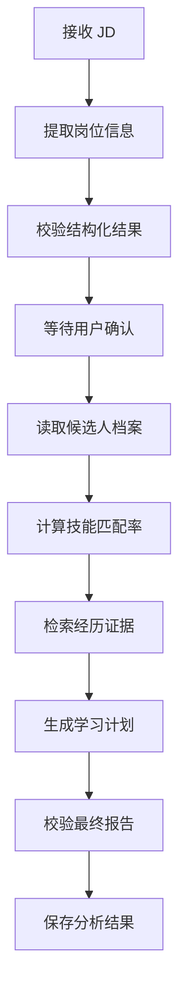
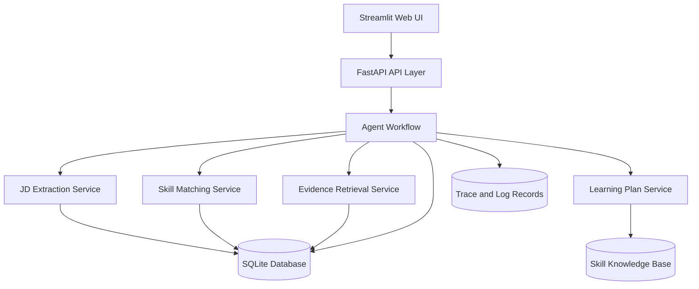

# CareerGraph Agent

一个面向技术岗位秋招的 JD 分析与技能差距管理 Agent。

CareerGraph Agent 可以读取目标岗位 JD，将岗位要求转换为结构化技能信息，并结合候选人的技能与项目经历，生成岗位匹配报告、经历证据和学习计划。

项目计划于 **2026 年 8 月 31 日前完成 MVP 开发和部署**。

---

## 1. 项目简介

在准备算法工程师、AI 应用开发工程师和 Agent 开发工程师秋招时，求职者通常需要同时分析大量岗位。

不同公司的岗位描述可能使用不同表达方式。例如：

- 熟悉 Python
- 具备 Python 编程能力
- 能够使用 Python 完成模型开发
- 有 Python 后端项目经验

这些描述背后可能对应相同或相近的能力，但仅靠人工阅读，容易出现以下问题：

- 不清楚 JD 中哪些技能是核心要求
- 不知道自己的项目经历能否证明相关能力
- 无法准确判断自己与岗位的差距
- 针对不同岗位仍然使用相同的准备方案
- 学习内容没有优先级
- 无法持续追踪技能补齐进度

CareerGraph Agent 希望将这套过程转化为一个结构化、可追踪和可评估的工作流。

---

## 2. 项目解决的问题

CareerGraph Agent 主要回答五个问题：

1. 这个岗位真正需要哪些技能？
2. 哪些技能是必须项，哪些是加分项？
3. 候选人当前满足了哪些要求？
4. 哪些项目经历能够证明相关能力？
5. 为了提高岗位匹配度，接下来应该优先学习什么？

项目不是一个简单的“输入一句话，模型回答一句话”的聊天 Demo，而是一个包含数据持久化、任务状态、工具调用、日志记录和结果评估的完整应用。

---

## 3. 目标用户

项目主要面向：

- 正在准备技术岗位校招的学生
- 同时投递多个岗位的求职者
- 希望根据 JD 调整准备方向的候选人
- 不清楚技能学习优先级的技术初学者
- 希望系统管理岗位分析结果和学习进度的用户

当前重点支持以下岗位：

- Python 后端开发工程师
- 算法工程师
- AI 应用开发工程师
- 大模型应用开发工程师
- RAG 开发工程师
- Agent 开发工程师

---

## 4. MVP 业务流程

```text
创建候选人档案
        ↓
输入目标岗位 JD
        ↓
提取岗位技能和要求
        ↓
用户确认或修改提取结果
        ↓
计算技能覆盖率
        ↓
查找缺失技能
        ↓
检索相关项目经历证据
        ↓
生成岗位匹配报告
        ↓
生成学习任务
        ↓
保存分析记录和学习进度
```

这条流程构成项目的最小业务闭环。

用户不仅能够看到一次分析结果，还可以保存岗位、更新技能、完成学习任务，并重新计算岗位匹配度。

---

## 5. 八月底 MVP 功能范围

### 5.1 候选人档案管理

用户可以维护自己的：

- 技能列表
- 项目经历
- 实习经历
- 技能熟练程度
- 学习中的技能
- 每段经历能够证明的能力

候选人数据会保存到数据库，而不是每次分析都重新输入。

示例：

```json
{
  "name": "Demo User",
  "target_roles": [
    "Python Backend Engineer",
    "Agent Engineer"
  ],
  "skills": [
    {
      "name": "Python",
      "level": "intermediate"
    },
    {
      "name": "pytest",
      "level": "beginner"
    }
  ],
  "experiences": [
    {
      "title": "CareerGraph Agent",
      "description": "使用 Python 开发岗位技能匹配模块，并通过 pytest 编写单元测试。",
      "skill_tags": [
        "Python",
        "pytest",
        "Git"
      ]
    }
  ]
}
```

---

### 5.2 JD 结构化分析

用户可以粘贴完整岗位描述。

系统从 JD 中提取：

- 岗位名称
- 岗位方向
- 工作职责
- 必须技能
- 加分技能
- 技能熟练程度
- 学历或经验要求

示例输出：

```json
{
  "job_title": "Agent Development Engineer",
  "job_category": "AI Application",
  "required_skills": [
    {
      "name": "Python",
      "importance": "required",
      "level": "proficient"
    },
    {
      "name": "FastAPI",
      "importance": "required",
      "level": "familiar"
    }
  ],
  "preferred_skills": [
    {
      "name": "RAG",
      "importance": "preferred",
      "level": "familiar"
    }
  ]
}
```

为了降低模型提取错误，系统不会直接将结果写入数据库。

用户可以在页面上确认、删除或修改提取出的技能，然后再继续分析。

---

### 5.3 技能标准化

在进行技能比较前，系统会统一处理技能名称。

当前需要处理的情况包括：

- 大小写不同
- 前后存在多余空格
- 重复技能
- 空字符串
- 只包含空格的字符串

例如：

```python
[
    " Python ",
    "python",
    "SQL",
    "",
    "   "
]
```

标准化后：

```python
{
    "python",
    "sql"
}
```

核心函数：

```python
def normalize_skills(skills: list[str]) -> set[str]:
    return {
        skill.strip().lower()
        for skill in skills
        if skill.strip()
    }
```

---

### 5.4 技能匹配与覆盖率计算

系统比较岗位要求技能和候选人技能，输出：

- 已匹配技能
- 缺失技能
- 必须技能覆盖率
- 加分技能覆盖率
- 综合岗位匹配分数

基础计算公式：

```text
必须技能覆盖率
= 已满足的必须技能数量 ÷ 必须技能总数
```

示例：

```python
required_skills = [
    "Python",
    "FastAPI",
    "SQL",
    "RAG",
]

candidate_skills = [
    "Python",
    "SQL",
    "Git",
]
```

输出：

```json
{
  "matched_skills": [
    "Python",
    "SQL"
  ],
  "missing_skills": [
    "FastAPI",
    "RAG"
  ],
  "required_skill_match_rate": 0.5
}
```

MVP 阶段采用明确、可解释的规则计算匹配率，不直接让大模型给出一个无法解释的百分数。

---

### 5.5 简历经历证据检索

系统会从候选人的项目和实习经历中查找能够证明岗位技能的内容。

例如，岗位要求：

```text
Python、pytest、API 开发
```

系统可能检索到：

```text
CareerGraph Agent：
使用 Python 开发技能匹配模块，
通过 pytest 编写大小写、重复值和空输入测试。
```

证据检索优先采用：

1. 技能标签精确匹配
2. 经历文本关键词匹配
3. 技能别名匹配
4. 文本相关性排序

MVP 暂不实现复杂向量数据库和大规模 RAG。

这种设计更容易测试和解释，也能够避免模型虚构候选人经历。

---

### 5.6 学习建议生成

系统根据缺失技能生成结构化学习任务。

学习建议需要包含：

- 学习优先级
- 推荐学习顺序
- 学习目标
- 实践任务
- 验收标准
- 当前状态

示例：

```json
{
  "skill": "FastAPI",
  "priority": "high",
  "reason": "该技能是目标岗位的必须要求",
  "tasks": [
    {
      "title": "创建基础 FastAPI 服务",
      "acceptance_criteria": "能够启动服务并访问健康检查接口"
    },
    {
      "title": "使用 Pydantic 校验请求参数",
      "acceptance_criteria": "错误输入能够返回明确的错误信息"
    },
    {
      "title": "为接口编写测试",
      "acceptance_criteria": "核心接口测试全部通过"
    }
  ]
}
```

学习内容优先从项目维护的技能知识库中读取。

大模型主要负责整理和解释，不负责凭空生成不可靠的技能路线。

---

### 5.7 学习进度管理

用户可以更新学习任务状态：

```text
todo
in_progress
completed
```

完成某项技能学习后，用户可以将技能加入个人档案，再次运行岗位分析。

系统会显示匹配率变化，例如：

```text
第一次分析：50%
完成 FastAPI 学习后：75%
```

这使项目形成完整闭环，而不是只生成一次报告。

---

### 5.8 历史岗位管理

系统会保存用户分析过的岗位，包括：

- 公司名称
- 岗位名称
- JD 原文
- 提取出的技能
- 分析时间
- 技能匹配率
- 缺失技能
- 生成的学习任务
- 当前准备状态

用户可以查看不同岗位之间的技能要求差异。

---

## 6. 本项目暂不实现的功能

为了确保项目能够在八月底前完成，MVP 暂不包含以下功能：

- 自动向招聘网站投递
- 自动发送求职邮件
- 自动修改并覆盖简历文件
- 多用户权限系统
- 复杂多 Agent 协作
- 大规模向量数据库
- 完整 PDF 简历解析
- 自动爬取招聘网站
- 覆盖所有技术岗位
- 自动训练机器学习模型
- 企业级高并发架构

这些功能可以作为后续迭代方向，但不会进入八月底 MVP 的必做范围。

---

## 7. Agent 设计

CareerGraph Agent 不采用“多个 Agent 越多越好”的设计。

MVP 使用一个主工作流，将任务拆分为多个明确节点。



每个节点只负责一个明确任务，便于测试、调试和替换。

---

## 8. Agent 能力体现

### 8.1 意图和任务识别

系统能够识别当前任务是：

- 创建候选人档案
- 分析岗位 JD
- 查看技能差距
- 生成学习计划
- 更新学习状态
- 查看历史分析结果

---

### 8.2 任务规划

系统将岗位分析任务拆分为：

```text
JD 解析
→ 数据校验
→ 用户确认
→ 技能匹配
→ 经历检索
→ 学习计划生成
→ 结果保存
```

不是将所有内容放进一个 Prompt 中一次性生成。

---

### 8.3 工具调用

Agent 工作流会调用不同工具：

- JD 信息提取工具
- 技能标准化工具
- 技能匹配工具
- 数据库查询工具
- 经历证据检索工具
- 学习知识库工具
- 结果校验工具

---

### 8.4 状态管理

每次分析任务拥有明确状态：

```text
pending
extracting
waiting_for_confirmation
matching
retrieving_evidence
generating_plan
completed
failed
```

系统能够知道任务执行到了哪一步。

如果某一步失败，不需要重新执行全部流程。

---

### 8.5 错误处理与重试

系统需要处理以下异常：

- JD 内容为空
- 模型返回格式错误
- 模型调用超时
- 技能列表为空
- 数据库查询失败
- 候选人档案不存在
- 学习知识库中没有对应技能
- 最终输出未通过数据校验

模型结构化输出失败时最多重试两次。

超过重试次数后，系统返回明确错误，而不是无限循环调用。

---

### 8.6 结果校验

最终报告生成前需要检查：

- 是否存在岗位名称
- 是否至少提取出一个岗位要求
- 覆盖率是否位于 0 到 1 之间
- 缺失技能是否来自岗位技能列表
- 经历证据是否真实存在于候选人档案
- 学习任务是否对应缺失技能

大模型不能添加候选人没有提供过的项目经历。

---

## 9. 上下文工程

项目不会将所有历史聊天和用户信息一次性传给模型。

系统将上下文划分为四类。

### 当前任务上下文

当前岗位分析真正需要的信息：

- 当前 JD
- 已提取技能
- 用户修改结果
- 当前任务状态
- 输出格式要求

### 用户档案上下文

候选人的长期信息：

- 技能
- 项目经历
- 实习经历
- 目标岗位
- 已完成学习任务

### 工具上下文

工具执行结果：

- 数据库查询结果
- 技能匹配结果
- 经历检索结果
- 错误信息
- 重试次数

### 全局知识上下文

系统维护的稳定内容：

- 技能别名
- 技能分类
- 学习任务模板
- 岗位类别
- 匹配规则

每个工作流节点只接收当前步骤需要的信息，避免无关信息影响模型判断。

---

## 10. Human-in-the-loop

项目在关键节点保留人工确认。

JD 技能提取完成后，用户需要确认：

- 技能是否提取正确
- 哪些属于必须项
- 哪些属于加分项
- 是否存在遗漏
- 是否存在错误技能

只有用户确认后，系统才会计算匹配率并生成学习计划。

MVP 不会自动修改简历，也不会自动投递岗位。

---

## 11. 系统架构



---

## 12. 技术栈

### 后端

- Python
- FastAPI
- Pydantic
- SQLAlchemy
- SQLite
- Uvicorn

### Agent 与模型

- 大模型 API
- Structured Output
- Function Calling
- 明确状态驱动的 Agent Workflow

### 前端

- Streamlit

### 测试

- pytest
- FastAPI TestClient

### 工程与部署

- Git
- GitHub
- Docker
- Python Logging

MVP 使用 SQLite 降低部署和数据库配置成本。

后续需要支持多人使用时，再迁移到 PostgreSQL。

---

## 13. 数据模型

### Candidate

```text
id
name
target_roles
created_at
updated_at
```

### Skill

```text
id
candidate_id
name
normalized_name
level
status
```

### Experience

```text
id
candidate_id
title
description
experience_type
created_at
```

### ExperienceSkill

```text
experience_id
skill_id
```

### Job

```text
id
company_name
job_title
jd_text
created_at
```

### JobSkill

```text
id
job_id
name
normalized_name
importance
level
```

### Analysis

```text
id
job_id
candidate_id
status
required_match_rate
preferred_match_rate
created_at
completed_at
```

### LearningTask

```text
id
analysis_id
skill_name
title
priority
status
acceptance_criteria
```

### TraceStep

```text
id
analysis_id
step_name
status
latency
error_message
created_at
```

---

## 14. API 设计

### 创建候选人档案

```http
POST /api/candidates
```

### 添加候选人技能

```http
POST /api/candidates/{candidate_id}/skills
```

### 添加项目经历

```http
POST /api/candidates/{candidate_id}/experiences
```

### 创建岗位

```http
POST /api/jobs
```

### 提取 JD 信息

```http
POST /api/jobs/{job_id}/extract
```

### 确认提取结果

```http
POST /api/jobs/{job_id}/confirm
```

### 执行岗位分析

```http
POST /api/analyses
```

### 查询分析任务状态

```http
GET /api/analyses/{analysis_id}
```

### 查询匹配报告

```http
GET /api/analyses/{analysis_id}/report
```

### 更新学习任务状态

```http
PATCH /api/learning-tasks/{task_id}
```

### 查询历史岗位

```http
GET /api/jobs
```

---

## 15. 示例输出

```json
{
  "job": {
    "company": "Example Technology",
    "title": "Agent Development Engineer"
  },
  "match_summary": {
    "required_skill_match_rate": 0.6,
    "preferred_skill_match_rate": 0.25
  },
  "matched_skills": [
    "Python",
    "Git",
    "pytest"
  ],
  "missing_skills": [
    "FastAPI",
    "Pydantic"
  ],
  "evidence": [
    {
      "skill": "Python",
      "experience": "CareerGraph Agent",
      "content": "使用 Python 实现技能标准化、缺失技能查找和岗位匹配率计算。"
    },
    {
      "skill": "pytest",
      "experience": "CareerGraph Agent",
      "content": "为大小写、空字符串、重复技能和空列表等情况编写单元测试。"
    }
  ],
  "learning_plan": [
    {
      "skill": "FastAPI",
      "priority": "high",
      "status": "todo",
      "tasks": [
        "创建基础 API 服务",
        "实现技能匹配接口",
        "增加异常处理",
        "编写接口测试"
      ]
    }
  ]
}
```

---

## 16. 可观测性

系统需要记录每次分析的执行过程。

日志至少包含：

- 分析任务 ID
- 当前工作流节点
- 节点开始和结束时间
- 节点执行状态
- 模型调用是否成功
- 工具调用是否成功
- 响应时间
- 重试次数
- 错误类型
- Token 使用量

示例：

```text
analysis_id=18
step=extract_job_skills
status=completed
latency_ms=1240
retry_count=0
```

日志中不直接记录完整简历和敏感个人信息。

---

## 17. 评估体系

项目不能只使用“结果看起来不错”作为判断标准。

### 17.1 技能标准化测试

测试以下情况：

- 正常输入
- 大小写不同
- 多余空格
- 重复技能
- 空列表
- 空字符串
- 只有空格的字符串
- 候选人包含额外技能
- 所有技能都匹配
- 所有技能都缺失

---

### 17.2 JD 技能提取评估

手动标注不少于 30 条技术岗位 JD。

评估：

- 技能提取 Precision
- 技能提取 Recall
- 技能提取 F1 Score
- 必须技能分类准确率
- 加分技能分类准确率

MVP 目标：

```text
技能提取 F1 Score >= 0.75
```

---

### 17.3 经历证据检索评估

准备一组“技能—候选人经历”标准答案。

评估系统返回的前三条经历中，是否包含正确证据。

MVP 目标：

```text
Top-3 Hit Rate >= 0.80
```

---

### 17.4 系统指标

记录：

- API 请求成功率
- 平均分析时间
- 模型调用失败率
- 工具调用失败率
- 任务完成率
- 平均 Token 消耗
- 用户修改技能提取结果的比例

---

## 18. 项目结构

```text
careergraph-agent/
├── README.md
├── requirements.txt
├── pyproject.toml
├── Dockerfile
├── .env.example
├── .gitignore
│
├── data/
│   ├── skill_catalog.json
│   ├── skill_aliases.json
│   └── evaluation_jobs.json
│
├── src/
│   └── careergraph/
│       ├── __init__.py
│       ├── config.py
│       │
│       ├── api/
│       │   ├── main.py
│       │   ├── dependencies.py
│       │   └── routes/
│       │       ├── candidates.py
│       │       ├── jobs.py
│       │       ├── analyses.py
│       │       └── learning_tasks.py
│       │
│       ├── agents/
│       │   ├── workflow.py
│       │   ├── state.py
│       │   └── nodes/
│       │       ├── extract_job.py
│       │       ├── match_skills.py
│       │       ├── retrieve_evidence.py
│       │       ├── generate_plan.py
│       │       └── validate_report.py
│       │
│       ├── skills/
│       │   ├── normalizer.py
│       │   ├── matcher.py
│       │   ├── aliases.py
│       │   └── scorer.py
│       │
│       ├── services/
│       │   ├── candidate_service.py
│       │   ├── job_service.py
│       │   ├── evidence_service.py
│       │   └── learning_service.py
│       │
│       ├── schemas/
│       │   ├── candidate.py
│       │   ├── job.py
│       │   ├── analysis.py
│       │   └── learning_task.py
│       │
│       ├── database/
│       │   ├── connection.py
│       │   ├── models.py
│       │   └── repositories/
│       │
│       └── observability/
│           ├── logger.py
│           └── tracer.py
│
├── streamlit_app/
│   ├── app.py
│   └── pages/
│       ├── candidate_profile.py
│       ├── job_analysis.py
│       ├── analysis_history.py
│       └── learning_progress.py
│
└── tests/
    ├── unit/
    │   ├── test_normalizer.py
    │   ├── test_matcher.py
    │   ├── test_scorer.py
    │   └── test_evidence_service.py
    │
    ├── integration/
    │   ├── test_job_api.py
    │   ├── test_analysis_api.py
    │   └── test_workflow.py
    │
    └── evaluation/
        └── test_jd_extraction.py
```

---

## 19. 本地运行

### 19.1 克隆项目

```bash
git clone https://github.com/your-username/careergraph-agent.git
cd careergraph-agent
```

### 19.2 创建虚拟环境

```bash
python -m venv .venv
```

Windows：

```bash
.venv\Scripts\activate
```

macOS 或 Linux：

```bash
source .venv/bin/activate
```

### 19.3 安装依赖

```bash
pip install -r requirements.txt
```

### 19.4 配置环境变量

复制配置文件：

```bash
cp .env.example .env
```

填写模型 API Key：

```env
LLM_API_KEY=your_api_key
DATABASE_URL=sqlite:///./careergraph.db
```

### 19.5 启动后端

```bash
uvicorn src.careergraph.api.main:app --reload
```

API 文档：

```text
http://127.0.0.1:8000/docs
```

### 19.6 启动前端

```bash
streamlit run streamlit_app/app.py
```

---

## 20. 运行测试

运行全部测试：

```bash
pytest
```

显示详细结果：

```bash
pytest -v
```

运行单元测试：

```bash
pytest tests/unit -v
```

运行接口测试：

```bash
pytest tests/integration -v
```

运行 JD 提取评估：

```bash
pytest tests/evaluation -v
```

生成覆盖率报告：

```bash
pytest --cov=src/careergraph --cov-report=term-missing
```

---

## 21. 八月底开发计划

### 第一阶段：基础技能匹配

时间：

```text
7 月 22 日—7 月 28 日
```

任务：

- 完成技能标准化函数
- 完成缺失技能查找
- 完成技能覆盖率计算
- 处理重复值、空值和大小写
- 编写 pytest 单元测试
- 整理 Python 项目结构

交付物：

- 可独立运行的技能匹配模块
- 不少于 15 个单元测试
- 基础 README

---

### 第二阶段：FastAPI 和数据库

时间：

```text
7 月 29 日—8 月 4 日
```

任务：

- 学习 FastAPI 基础
- 使用 Pydantic 定义请求和响应
- 创建候选人、技能、经历和岗位模型
- 使用 SQLite 保存数据
- 完成候选人档案接口
- 完成岗位创建接口
- 编写接口测试

交付物：

- 可运行的 FastAPI 服务
- 自动生成的 API 文档
- 基础数据库持久化

---

### 第三阶段：JD 结构化提取

时间：

```text
8 月 5 日—8 月 11 日
```

任务：

- 接入大模型 API
- 使用 Structured Output 提取 JD
- 区分必须技能和加分技能
- 使用 Pydantic 校验模型结果
- 添加格式错误重试
- 支持用户确认和修改
- 建立 30 条 JD 小型评估集

交付物：

- JD 提取接口
- 用户确认流程
- 第一版技能提取评估结果

---

### 第四阶段：Agent 工作流

时间：

```text
8 月 12 日—8 月 18 日
```

任务：

- 定义 Agent State
- 拆分工作流节点
- 添加任务状态管理
- 完成技能匹配节点
- 完成经历检索节点
- 完成学习计划节点
- 添加最终结果校验
- 保存每一步执行状态

交付物：

- 一条完整岗位分析工作流
- 支持失败状态和有限重试
- 可查询任务执行进度

---

### 第五阶段：页面和可观测性

时间：

```text
8 月 19 日—8 月 25 日
```

任务：

- 使用 Streamlit 创建操作页面
- 创建候选人档案页面
- 创建 JD 分析页面
- 创建历史记录页面
- 创建学习进度页面
- 增加结构化日志
- 记录响应时间和错误
- 完善异常提示

交付物：

- 可实际操作的 Web 页面
- 分析记录和学习任务可视化
- Agent Trace 日志

---

### 第六阶段：测试、部署和项目包装

时间：

```text
8 月 26 日—8 月 31 日
```

任务：

- 完成端到端测试
- 修复主要 Bug
- 编写 Dockerfile
- 完成部署
- 补充示例数据
- 录制项目演示视频
- 完善 README
- 整理项目架构图
- 记录评估结果
- 整理可写入简历的项目描述

交付物：

- 可运行的完整 MVP
- Docker 部署版本
- 项目演示视频
- API 文档
- 测试报告
- 评估报告
- 完整 GitHub 仓库

---

## 22. 八月底完成标准

项目达到以下条件，才视为 MVP 完成：

- [ ] 用户可以创建并保存个人技能和项目经历
- [ ] 用户可以输入一段完整 JD
- [ ] 系统可以提取必须技能和加分技能
- [ ] 用户可以确认或修改技能提取结果
- [ ] 系统可以计算技能覆盖率
- [ ] 系统可以输出缺失技能
- [ ] 系统可以从已有经历中检索技能证据
- [ ] 系统可以生成结构化学习任务
- [ ] 用户可以更新学习任务状态
- [ ] 系统可以保存历史岗位分析记录
- [ ] 工作流具有明确的任务状态
- [ ] 模型输出错误时具有重试和兜底处理
- [ ] 系统具有基础日志和执行追踪
- [ ] 核心业务逻辑具有单元测试
- [ ] 主要接口具有集成测试
- [ ] 项目能够通过 Docker 启动
- [ ] GitHub README 包含运行方法和演示结果

---

## 23. 当前进度

截至目前，项目处于第一阶段。

已完成：

- [x] 明确项目目标用户
- [x] 明确 MVP 业务问题
- [x] 设计技能匹配流程
- [x] 实现基础技能标准化思路
- [x] 实现缺失技能查找思路
- [x] 实现技能覆盖率计算思路

正在完成：

- [ ] 完善三个核心函数
- [ ] 处理空字符串和重复技能
- [ ] 编写 pytest 测试
- [ ] 建立正式项目目录
- [ ] 将代码提交到 GitHub

---

## 24. 项目设计原则

### 先解决真实问题

项目所有功能都围绕秋招岗位分析和学习准备展开，不为了展示框架而增加无关功能。

### 单 Agent 优先

MVP 使用一个清晰、可测试的工作流。

只有当多个角色确实需要独立上下文和独立工具时，才考虑拆分多个 Agent。

### 规则与模型结合

技能覆盖率、状态转换和数据校验使用确定性代码完成。

大模型负责自然语言理解和内容整理，不负责所有业务逻辑。

### 关键步骤允许人工确认

JD 提取结果需要用户确认，避免错误分析影响后续学习计划。

### 可观测和可评估

系统记录每个工作流节点的状态、错误和响应时间，并通过测试集评估 JD 技能提取结果。

### 不虚构用户经历

系统只允许引用候选人已经保存的项目和实习经历。

找不到证据时，应明确返回“当前档案中没有相关证据”。

---

## 25. 项目价值

CareerGraph Agent 将原本分散的求职准备流程连接起来：

```text
岗位分析
→ 技能匹配
→ 经历证明
→ 技能补齐
→ 进度追踪
→ 重新评估
```

通过持续分析不同岗位，用户可以逐渐形成自己的职业能力图谱，并回答：

- 自己已经掌握哪些技能
- 哪些项目可以证明这些技能
- 与目标岗位还有哪些差距
- 哪些技能在多个岗位中频繁出现
- 下一个阶段最值得学习什么
- 学习后岗位匹配率是否得到提升

---

## 26. 后续规划

八月底 MVP 完成后，再考虑以下功能：

- PDF 和 DOCX 简历解析
- 向量数据库和 RAG
- 简历内容优化建议
- 针对性面试题生成
- 模拟面试
- 投递状态管理
- 岗位之间的技能趋势分析
- PostgreSQL 数据库
- 用户登录和数据隔离
- 更完整的 Agent 自动评估体系

---

## 27. License

This project is developed for learning, portfolio building and graduate job preparation.